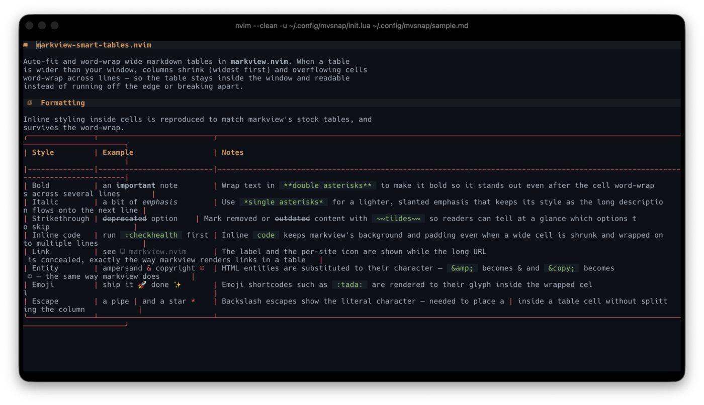
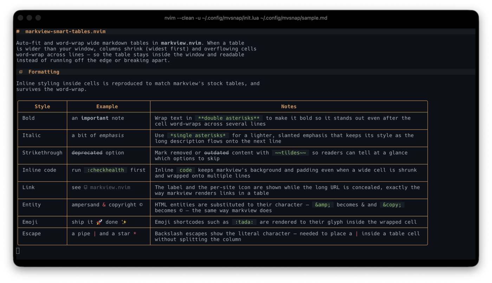

# markview-smart-tables.nvim

Auto-fit and word-wrap wide markdown tables in [markview.nvim](https://github.com/OXY2DEV/markview.nvim).

Markview renders tables beautifully — until one is wider than your window. With
`'wrap'` on, wide tables fall back to a degraded rendering; with `'wrap'` off
they run past the right edge. This plugin fits oversized tables to the window:
columns shrink (widest first), overflowing cells word-wrap across lines, and a
thin rule separates data rows so multi-line rows stay readable.

It plugs into markview's [custom renderer](https://github.com/OXY2DEV/markview.nvim)
mechanism — no fork, no patches. Tables that don't need fitting keep markview's
stock rendering.

**Stock markview** — a wide table soft-wraps into a broken layout:

<p align="center">
  
</p>

**With markview-smart-tables** — the same table is auto-fit and word-wrapped, with inline styling (bold, italic, code, links) preserved:

<p align="center">
  
</p>

## Requirements

- Neovim **0.11+** (`conceal_lines`); older versions transparently fall back to
  stock markview rendering
- [markview.nvim](https://github.com/OXY2DEV/markview.nvim)

## Install

With [lazy.nvim](https://github.com/folke/lazy.nvim):

```lua
{
  "gunasekar/markview-smart-tables.nvim",
  dependencies = { "OXY2DEV/markview.nvim" },
  opts = {
    wrap_width = 0.9,    -- max table width: fraction of the window (0<n<=1)
                         -- or absolute column count (n>1)
    wrap_minwidth = 5,   -- smallest a column may shrink to before long
                         -- words are hard-broken
  },
},
```

Then wire it into markview's table rendering — this step is **required**; the
`opts` above do nothing on their own:

```lua
require("markview").setup({
  renderers = {
    markdown_table = function (buffer, item)
      require("markview-smart-tables").render(buffer, item)
    end,
  },
});
```

Run `:checkhealth markview-smart-tables` to verify the Neovim version, that
markview is installed, and that the renderer hook is wired up.

## How it behaves

- **`'wrap'` on** — every table is drawn fitted to the window (soft-wrap breaks
  markview's normal in-buffer table rendering, so the fitted form replaces the
  degraded fallback you'd otherwise get).
- **`'wrap'` off** — only tables that overflow the window are fitted; fitting
  tables keep markview's stock in-buffer rendering (real text, visible cursor).
- **Editing / navigating** — a fitted table is drawn over its source lines,
  which are concealed to zero height, so the cursor is invisible while it is on
  the table (in any mode). Reveal the raw markdown to navigate or edit it with
  markview's hybrid mode (`preview.hybrid_modes`) — see [Editing and navigating
  fitted tables](#editing-and-navigating-fitted-tables).
- **Inline styling** — bold, italic, strikethrough, inline code, and links
  inside cells are preserved through the word-wrap. Styling is read from
  treesitter (the same captures markview uses); code spans and links additionally
  reuse markview's own config (code padding/highlight, and the link icon +
  highlight resolved through markview's matcher — a github URL gets its github
  glyph). Text markview substitutes — entities (`&amp;` → `&`), emoji shortcodes,
  escapes (`\|` → `|`) — is applied too (via markview's `tostring`), so fitted
  cells match markview's stock tables.
- **Window resizes** (splits, sidebars, terminal) re-fit tables automatically.
- Tables mid-edit (e.g. a row missing its leading `|`), tables markview can't
  place virtually, and Neovim < 0.11 all fall back to stock rendering — the
  plugin never hides content it can't redraw.

The table borders, separators, and highlights reuse your markview
`markdown.tables` `parts`/`hl` configuration, so fitted tables match your theme.

## Editing and navigating fitted tables

A fitted table is drawn as virtual text over its source lines, which are
concealed to **zero screen height** (`conceal_lines`) — that is what lets cells
wrap onto multiple lines. This has an inherent trade-off: the cursor lives in
that hidden text, so **while the cursor is on a fitted table it is invisible**.
A motion like `e` walks through the cells, but the cursor appears pinned to the
table's top line until it leaves — in *any* mode, not just when editing. You
cannot have the fitted render and a visibly tracking cursor on the same lines at
once; this is true of any fully-virtual table rendering.

To get a visible cursor (and to edit), reveal the raw markdown with markview's
**hybrid mode** by listing the modes you navigate/edit in under
`preview.hybrid_modes`. It is **empty by default**, so nothing reveals until you
set it:

```lua
require("markview").setup({
  preview = {
    -- Reveal the node under the cursor in these modes. Modes: "n" normal,
    -- "v"/"V" charwise/linewise visual, "i" insert.
    hybrid_modes = { "n", "v", "V", "i" },
  },
})
```

Now moving the cursor onto a table reveals its raw `| a | b |` rows (visible,
navigable, editable) and moving off re-fits it. The trade-off is that a wide
table shows raw (unfitted) *while the cursor is on it* — drop modes from the
list to limit when that happens (e.g. `{ "i" }` reveals only while editing).

## How it compares to stock markview rendering

Both produce the same box-drawing table on screen and share the same theme
configuration. They differ in *how* that table is drawn, which leads to
different trade-offs.

**Rendering model.** Stock markview decorates the buffer in place: the real
markdown line stays in the buffer and extmarks are layered on top — the `|`
characters are concealed and replaced with inline virtual border glyphs, cells
are padded with virtual spaces, and the outer borders are drawn as virtual
text/lines. The cell text on screen is the buffer's own text. Smart tables
instead hides the source lines (`conceal_lines`, zero screen height) and emits
the entire table — borders, headers, and every cell, including wrapped lines —
as virtual lines. The cell text on screen is a re-tokenized copy painted over
the concealed source.

**Why the difference exists.** Inline virtual text is positioned by buffer
column, and Neovim computes soft-wrap break points from raw buffer columns
before virtual text is applied. So when a table line is wider than the window
and `'wrap'` is on, the in-place decorations break apart at the wrap point;
markview detects this and returns early, leaving the raw wrapped markdown. A
virtual-line block is not soft-wrapped mid-glyph and the concealed source has
zero height, so cell text can be laid out across multiple lines. Moving a cell's
text onto a second line is only possible in the virtual-line model, because the
in-place model has no second buffer line to place it on.

**Relation to a from-scratch CLI renderer.** Smart tables follows the pipeline a
standalone terminal table tool uses — tokenize cells, measure columns, fit to a
width budget, word-wrap, emit complete lines — and composes an independent
display list rather than annotating existing text. Stock markview's model is
editor-coupled: it relies on buffer-anchored conceal and inline virtual text to
augment text that remains in the buffer, which keeps that text real (the cursor
lands on it, edits apply directly) without composing a separate grid.

**Resource usage.** The in-place model emits a small, fixed number of extmarks
per line and reflows with the buffer. The virtual model does more per fitted
table: it runs a `markdown_inline` treesitter parse per cell to recover inline
styling, performs the fit/word-wrap computation, and emits a virtual line per
output line; because the layout is sized to the window, it also installs a
debounced resize autocmd (lazily, only once a fitted table is actually drawn).
Smart tables declines back to stock rendering when fitting isn't needed (table
already fits with `'wrap'` off, Neovim < 0.11, mid-edit rows, `linewise_hybrid_mode`,
no anchor line), so the extra cost applies only to tables it fits.

## Options

| Option          | Default | Description                                                              |
|-----------------|---------|--------------------------------------------------------------------------|
| `enable`        | `true`  | Render smart tables (`false` = stock markview rendering only)            |
| `wrap_width`    | `0.9`   | Max table width — window fraction (`0<n<=1`) or absolute columns (`n>1`) |
| `wrap_minwidth` | `5`     | Smallest column width before long words are hard-broken                  |

## Known limitations

- Inline cell styling needs treesitter (the `markdown_inline` parser, which
  markview requires anyway). Without it, cells fall back to markview's `tostring`
  — correct text, no per-span highlights.
- This plugin reaches into a few markview internals (see
  [ARCHITECTURE.md](ARCHITECTURE.md#markview-surface)); a major
  markview refactor may require a plugin update.

See [ARCHITECTURE.md](ARCHITECTURE.md) for how the rendering works
internally.

## Development

```sh
make lint     # luacheck + stylua --check (see .luacheckrc, stylua.toml)
make format   # apply stylua formatting in place
make test     # fit/word-wrap + inline-styling tests, via `nvim -l tests/run.lua`
make docs     # regenerate doc/tags from the vimdoc
```

CI runs lint/format checks and `test` (Neovim stable + nightly) on every push
and PR.
